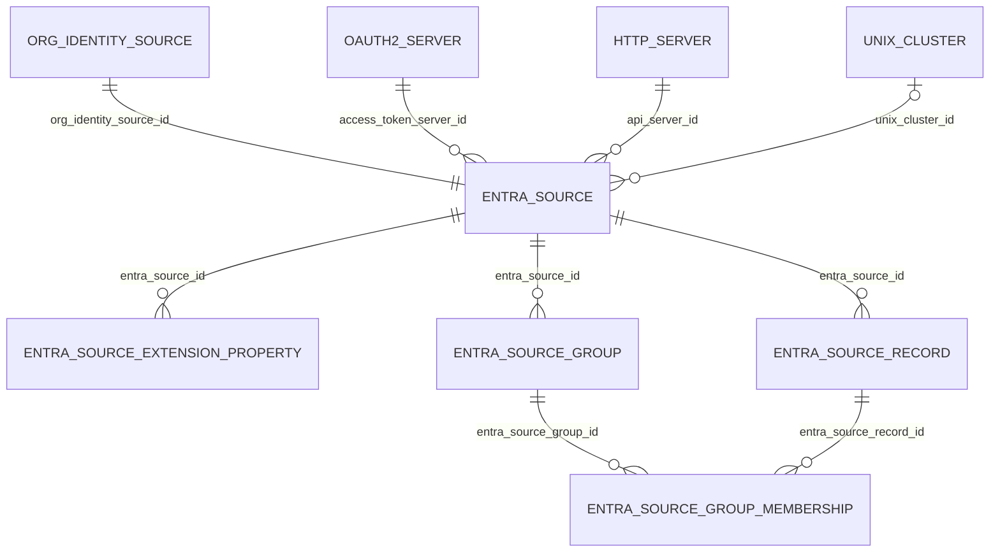

# Developer guide

This page is for whoever maintains the plugin's code. It covers the plugin's tables and
models, how the backend is organized, how the Microsoft Graph client behaves (paging,
throttling, errors), what each log message means, and the open TODOs. It describes the
code as it is now.

Other pages own the rest, so this page links to them and does not repeat them:

- [How sync works](how-sync-works.md): the sync flow, its timing, and the Registry
  objects the plugin creates.
- [Configuration](configuration.md): what each configuration field means.
- [Entra contract](entra-contract.md): the Graph calls, the permissions they need, and
  the attributes the plugin reads.
- [Assumptions and known gaps](assumptions-and-gaps.md): Missouri-specific hardcoded
  values and what each TODO does to the data.

Code is cited by repo-relative file and function name, not line number. Unless noted,
the file is `Model/EntraSourceBackend.php`.

## Layout of the repository

| Path | What it holds |
| ---- | ------------- |
| `Config/Schema/schema.xml` | The plugin's five tables, in AdoDB XML format |
| `Model/` | One model per table, plus `EntraSourceBackend.php` (the OIS backend) and an empty `EntraSourceAppModel.php` |
| `Controller/` | `EntraSourcesController.php`, `EntraSourceExtensionPropertiesController.php`, and an empty `EntraSourceAppController.php` |
| `View/` | Form and index templates for the two controllers |
| `Lib/lang.php` | All plugin strings, in `$cm_entra_source_texts['en_US']` |
| `Console/`, `Locale/`, `Test/`, `webroot/`, `View/Elements/`, `View/Helper/`, `View/Layouts/` | Scaffolding only; each holds just a placeholder file named `empty` |

## Data model

### Tables and models

The table names below have no prefix. The foreign key constraints in `schema.xml` name
the prefixed tables (`cm_...`).

**`entra_sources`, model `EntraSource` (`Model/EntraSource.php`).** One row per
EntraSource, which is the plugin's configuration for one Organizational Identity Source
(OIS). The fields are described on [Configuration](configuration.md). Columns that matter
to the code:

- `org_identity_source_id`: the Registry OIS that owns this row. Unique index
  `entra_sources_i1`.
- `access_token_server_id`: an `Oauth2Server` id (the column name says "server", but
  `apiConnect()` looks it up as `Oauth2Server.id`).
- `api_server_id`: an `HttpServer` id, also looked up by `apiConnect()`.
- `use_source_groups`, `source_group_filter`, `max_inventory_cache`, `unix_cluster_id`:
  configuration read by the backend through `getConfig()`.
- `inventory_cache_start`: written by `recordInventoryStart()` at the start of every
  full inventory and read by `inventoryCacheValid()`. This is sync state stored in the
  configuration row.

The model sets `$cmPluginType = "orgidsource"`, declares `$cmPluginHasMany` for
`OAuth2Server`, `HttpServer`, and `UnixCluster`, and `belongsTo` `OrgIdentitySource`,
`Server`, and `UnixCluster`. The table has no `server_id` column; the backend uses the
`Server` association only as a path to the `Oauth2Server` and `HttpServer` models (for
example `$EntraSource->Server->Oauth2Server->isExpired()` in `apiRequest()`). It
`hasMany` `EntraSourceRecord`, `EntraSourceGroup`, and `EntraSourceExtensionProperty`,
all with `dependent => true`. `cmPluginMenus()` returns an empty array, so the plugin
adds no menu items.

**`entra_source_extension_properties`, model `EntraSourceExtensionProperty`.**
Configuration, not sync state. One row per user schema extension property to read from
Graph and map to an Org Identity Identifier:

- `entra_source_id`: the owning EntraSource.
- `property`: the full Graph property name. `retrieve()` and `search()` add it to
  `$select`; `resultToOrgIdentity()` reads it from the user record.
- `identifier_type`: the Registry Identifier type the value is stored as.

The model also has `findCoForRecord()`, which the Registry's standard controller uses to
find the CO for a row.

**`entra_source_groups`, model `EntraSourceGroup`.** One row per source group per
EntraSource, written by `synchronizeSourceGroups()`:

- `entra_source_id`: the owning EntraSource.
- `mail_nickname`: the group's Entra `mailNickname`. The code finds an existing row by
  `mail_nickname` and `entra_source_id`, and it is the name of the matching CO Group.
- `graph_id`: the Entra group object id. Unique index `entra_source_groups_i2` covers
  this column alone, not the pair with `entra_source_id`.
- `gidnumber`: the group's gidNumber, if Entra has one.

`schema.xml` also declares index `entra_source_groups_i1` on `org_identity_source_id`,
a column this table does not have.

**`entra_source_records`, model `EntraSourceRecord`.** One row per Entra user the
plugin knows about, written by `addSourceRecord()`:

- `entra_source_id`: the owning EntraSource.
- `graph_id`: the Entra user object id. This is the key returned by `inventory()` and
  passed to `retrieve()`. It is indexed (`entra_source_records_i2`) but not unique.

No code deletes rows from this table except the cascade when an EntraSource is deleted
(see [Source records are never removed](assumptions-and-gaps.md#source-records-are-never-removed)).
The previous version of `README.md` said records are deleted when no longer part of any
group; that is not what the code does.

**`entra_source_group_memberships`, model `EntraSourceGroupMembership`.** One row per
(source group, source record) pair, written and deleted by
`synchronizeTransitiveMembers()`:

- `entra_source_group_id`, `entra_source_record_id`. Index
  `entra_source_group_memberships_i1` covers both and is not unique; the code checks for
  an existing row before it saves.

`retrieve()` reads these rows to build `memberOf`. The model's `$displayField` is
`mail_nickname`, which is not a column of this table.

### Relationships

`OrgIdentitySource`, `Oauth2Server`, `HttpServer`, and `UnixCluster` are Registry (or
UnixCluster plugin) models. Every `hasMany` in the plugin models is `dependent`, and
CakePHP's `delete()` cascades by default, so deleting an EntraSourceGroup (as
`synchronizeSourceGroups()` does) also deletes its memberships.

### Controllers and views

- **`Controller/EntraSourcesController.php`** extends the Registry's `SOISController`.
  `beforeRender()` builds the three select lists for the form, limited to the current
  CO: `vv_access_token_server_ids` (Oauth2Servers), `vv_api_server_ids` (HttpServers),
  and `vv_unix_clusters`. `isAuthorized()` grants `delete`, `edit`, `index`, and `view`
  to CMP admins, and to CO admins when org identities are not pooled. There is no `add`
  permission and no add view.
- **`Controller/EntraSourceExtensionPropertiesController.php`** extends
  `StandardController`. The owning EntraSource comes from the named parameter `esid`
  (or the posted `entra_source_id`, or the edited row). `beforeFilter()` sets
  `vv_entra_source`, `vv_esid`, and `vv_identifier_types` (the CO's CoPerson Identifier
  types). `paginationConditions()` limits the index to one EntraSource, and
  `performRedirect()` returns to that index. Permissions match the other controller,
  plus `add`. In `calculateImpliedCoId()`, the not-found exception message uses
  `ct.clusters.1` and an undefined `$cid`, copied from another plugin.
- **`View/EntraSources/`**: `fields.inc` (the form), `buttons.inc` (adds the "Manage
  Schema Extension Properties" link using `op.manage-a`), and `edit.ctp`.
- **`View/EntraSourceExtensionProperties/`**: `fields.inc`, `index.ctp`, `add.ctp`, and
  `edit.ctp`.
- The `add.ctp` and `edit.ctp` files are symlinks to
  `../../../../../app/View/Standard/add.ctp` and `edit.ctp`. Following the Registry
  convention, the standard template renders the plugin's `fields.inc`. The links resolve
  only when the plugin is installed three levels below the Registry root (for example
  `local/Plugin/EntraSource/`, so each `View/<Controller>/` directory sits five levels
  down); in a standalone checkout they dangle.
- **`Lib/lang.php`**: every user-facing string. Keys start with `ct.` (titles), `er.`
  (errors), or `pl.` (form labels and descriptions). The Registry merges
  `$cm_entra_source_texts` into its own strings. Add new strings here, not in
  controllers or views.

## How the backend is organized

`Model/EntraSourceBackend.php` defines `EntraSourceBackend`, which extends the Registry's
abstract `OrgIdentitySourceBackend`. The Registry calls its public OIS methods; the
protected helpers do the work. `getConfig()` (inherited) returns the `EntraSource` row.

The backend caches three things on the instance: `$accessTokenServer` and `$apiServer`
(set by `apiConnect()`), and `$activeId` (the EntraSource id, used by `log()`). Each
helper creates its own `new EntraSource()` model to reach the plugin tables.

### Public OIS methods

| Method | Calls | Notes |
| ------ | ----- | ----- |
| `inventory()` | `inventoryCacheValid()`, `inventoryFromCache()`, `recordInventoryStart()`, `apiConnect()`, then `inventoryBySourceGroups()` or `inventoryAllUsers()` | Returns a list of Entra user object ids. The cache check runs only when `use_source_groups` is on. |
| `retrieve($id)` | `apiConnect()`, `inventory()`, `getExtensionProperties()`, `apiRequest()` (`users/{id}`), `addSourceRecord()`, `resultToOrgIdentity()` | Builds `memberOf` from stored memberships. The calls to `synchronizeSourceGroups()`, `getFilteredSourceGroupsForSourceRecord()`, and `syncMembershipsSourceRecord()` are commented out. |
| `search($attributes)` | `apiConnect()`, `getExtensionProperties()`, `apiRequest()` (`/users` filtered on `mail`), and when `use_source_groups` is on, `synchronizeSourceGroups()` and `getFilteredSourceGroupsForSourceRecord()`; then `resultToOrgIdentity()` | Reads only `$attributes['mail']` and uses only the first match. |
| `searchableAttributes()` | none | Returns `mail`, labeled with `pl.entrasource.search.mail`. |
| `groupableAttributes()` | none | Returns `memberOf`. |
| `resultToGroups($raw)` | none | Turns the `memberOf` list in the raw JSON from `retrieve()` into `memberOf` values. |
| `log($msg, $type, $scope)` | parent `log()` | Not an OIS method; overrides logging (see [Logging](#logging)). |

What these methods mean for a sync, step by step, is on
[How sync works](how-sync-works.md).

### Protected helpers

| Helper | Used by | Does |
| ------ | ------- | ---- |
| `apiConnect()` | `inventory()`, `retrieve()`, `search()`, `apiRequest()` | Loads the two Server records and creates the `HttpSocket`. |
| `apiRequest()` | every Graph call | Token refresh, URL, headers, 429 retry, error check, JSON decode. |
| `inventoryCacheValid()` | `inventory()` | True if `inventory_cache_start` plus `max_inventory_cache` minutes is in the future. |
| `inventoryFromCache()` | `inventory()`, `inventoryBySourceGroups()` | Returns the `graph_id` of every EntraSourceRecord, not filtered by EntraSource. |
| `recordInventoryStart()` | `inventory()` | Saves the current time to `inventory_cache_start`. |
| `inventoryAllUsers()` | `inventory()` | Returns an empty array ("Not currently supported"). |
| `inventoryBySourceGroups()` | `inventory()` | `synchronizeSourceGroups()`, then `inventoryOneSourceGroup()` for each stored group, then `inventoryFromCache()`. |
| `synchronizeSourceGroups()` | `inventoryBySourceGroups()`, `search()` | Lists Graph groups, reconciles EntraSourceGroup rows, ensures the Registry objects for each group. |
| `inventoryOneSourceGroup()` | `inventoryBySourceGroups()` | Pages through one group's transitive user members, then `synchronizeTransitiveMembers()`. |
| `synchronizeTransitiveMembers()` | `inventoryOneSourceGroup()` | `addSourceRecord()` and membership rows for each member; deletes memberships of users no longer listed. Passes a third argument to `addSourceRecord()`, which takes two. |
| `addSourceRecord()` | `synchronizeTransitiveMembers()`, `retrieve()` | Finds or creates the EntraSourceRecord for a Graph user id. |
| `getExtensionProperties()` | `retrieve()`, `search()` | Returns the EntraSourceExtensionProperty rows for this EntraSource. |
| `getFilteredSourceGroupsForSourceRecord()` | `search()` | Pages through a user's `transitiveMemberOf`, keeps groups that match a stored EntraSourceGroup. |
| `syncMembershipsSourceRecord()` | nothing (its call in `retrieve()` is commented out) | Would reconcile one record's memberships from `getFilteredSourceGroupsForSourceRecord()` output. |
| `resultToOrgIdentity()` | `retrieve()`, `search()` | Maps a Graph user record to Org Identity format. |

None of the helpers checks the return value of a model `save()` or `delete()`.

## Graph client

### apiConnect()

`apiConnect()` reads `access_token_server_id` and `api_server_id` from the
configuration, loads the `Oauth2Server` and `HttpServer` rows into `$accessTokenServer`
and `$apiServer`, and creates `$this->Http` (a CakePHP `HttpSocket`). If either row is
missing it throws `InvalidArgumentException` with the Registry string `er.notfound`.
It holds no credentials of its own; the token, its expiry, and the Graph base URL all
come from those Registry records (see [Configuration](configuration.md)).

The public methods call it before any Graph request. `apiRequest()` calls it again after
it gets a new token, to reload `$accessTokenServer` with that token.

### apiRequest()

`apiRequest($urlPath, $action = "get", $query = array(), $headers = array())` does, in
order:

1. **Token.** Asks `Oauth2Server->isExpired()` whether the token expires within 10
   seconds (`$deltat`). If so, or if the answer is `null`, calls
   `Oauth2Server->obtainToken()` with `client_credentials`. If the result has no
   `access_token` property, it logs `er.entrasource.access_token.unable` and throws
   `RuntimeException`. Otherwise it calls `apiConnect()` again.
2. **Headers.** Sends `Authorization: Bearer <token>`, plus any `$headers` passed in.
   Only `search()` passes one (`ConsistencyLevel: eventual`).
3. **URL.** If `$urlPath` starts with the HttpServer `serverurl`, it is used as is.
   Otherwise the URL is `serverurl . '/' . $urlPath`. This lets callers pass an
   `@odata.nextLink` (an absolute URL) back in unchanged, as long as `serverurl` is a
   prefix of the URL Graph returns. `search()` passes `/users` with a leading slash, so
   its URL has two slashes after the base.
4. **Request and 429 loop.** Calls `$this->Http->$action($url, $query, $options)` in a
   `do ... while` loop:
   - On HTTP 429 it logs the throttling messages, reads `Retry-After` with
     `(int) $response->getHeader('Retry-After')`, sleeps that many seconds, and sends
     the same request again. There is no retry limit.
   - The 5-second fallback is in a `catch` block around that read. CakePHP's
     `getHeader()` returns `null` for a missing header rather than throwing, and the
     `(int)` cast turns `null` into 0. So a 429 without `Retry-After` logs a value of 0
     and retries at once; the fallback runs only if the read throws.
   - Any other status that is not 200 logs `er.entrasource.api.code` and then the raw
     response body, and throws `RuntimeException`. 201 or 204 would also count as
     failures, but every call the plugin makes is a `GET`.
5. **Decode.** Returns `json_decode($response->body, true, 512, JSON_THROW_ON_ERROR)`,
   so a body that is not JSON throws `JsonException`.

### Paging

`apiRequest()` does not page. Each caller loops on `@odata.nextLink`: on the first
request it sends its own path and query (with `$top=999`); on later requests it passes
the `nextLink` URL as `$urlPath` with an empty query. The loops are in
`synchronizeSourceGroups()`, `inventoryOneSourceGroup()`, and
`getFilteredSourceGroupsForSourceRecord()`. `synchronizeSourceGroups()` and
`getFilteredSourceGroupsForSourceRecord()` also stop when a page has an empty `value`.
`retrieve()` and `search()` make one request each and do not page. Which endpoints these
are is on [Entra contract](entra-contract.md).

### Error handling per caller

Exceptions from `apiConnect()`, `apiRequest()`, and token refresh propagate unless a
caller catches them. Only one caller does.

| Caller | Catches? | Result of a failure |
| ------ | -------- | ------------------- |
| `inventoryOneSourceGroup()` | Yes, `catch (Exception $e)` around each page request | Logs the exception and returns. That group is skipped: `synchronizeTransitiveMembers()` is not called, even if earlier pages succeeded, so the group's stored memberships stay as they were. The inventory continues with the next group. |
| `synchronizeSourceGroups()` | No | Propagates through `inventoryBySourceGroups()` and `inventory()` (and through `retrieve()`, which calls `inventory()`), or through `search()`. `inventory_cache_start` was already written, so later inventories use the cache until it expires. |
| `getFilteredSourceGroupsForSourceRecord()` | No | Propagates through `search()`. |
| `retrieve()` (`users/{id}`) | No | The retrieve fails. |
| `search()` (`/users`) | No | The search fails. |

What staff see when each of these fails is on
[Entra contract](entra-contract.md#when-a-graph-call-fails).

## Logging

### How the plugin logs

`EntraSourceBackend::log()` overrides the parent `log()`. On first use it caches the
EntraSource id from `getConfig()` in `$activeId`, then prepends
`EntraSourceBackend ID <id>: ` to every message and passes it on. The default level is
`LOG_ERR`, and no call in the backend passes another level, so every plugin message,
including routine progress messages, is written at error level.

The parent call reaches CakePHP's `CakeObject::log()`, which calls `CakeLog::write()`.
Where the line ends up is set by the Registry's CakeLog configuration, not by this
repository. In the stock `app/Config/bootstrap.php` of Registry 4.6.0, error-level
messages go to the `error` FileLog, which is `error.log` in the Registry's `LOGS`
directory (by default `app/tmp/logs/error.log`). A deployment can change that.

The controllers and models other than the backend do not log.

Messages built with `_txt()` come from `Lib/lang.php`. When a key is missing, the
Registry's `_txt()` returns the key itself, and that is what gets logged. Two keys the
backend uses are missing (see the throttling rows below).

Several messages append `print_r()` of an array or of an exception object, so one log
entry can span many lines.

### Messages

In the table, `<id>` is the EntraSource id, `<name>` is a group's mailNickname, and
`<n>` is a number. Every line starts with `EntraSourceBackend ID <id>: `.

| Message text (after the prefix) | Logged by | Meaning |
| ------------------------------- | --------- | ------- |
| `inventory cache is valid` | `inventory()` | Cache window still open; the inventory comes from stored records and no Graph call is made. |
| `inventory cache is invalid` | `inventory()` | Cache window expired (or never set); a full inventory follows. |
| `inventory called` | `inventory()` | A full inventory is starting. Logged after the cache check, so it also appears when `use_source_groups` is off. |
| `inventory is returning` | `inventory()` | A full inventory finished without an uncaught exception. |
| `inventoring source group <name>` | `inventoryOneSourceGroup()` | Starting one source group. ("inventoring" is spelled this way in the code.) |
| `inventoryOneSourceGroup caught exception: ` followed by the `print_r()` of the exception | `inventoryOneSourceGroup()` | A Graph call for this group failed; the group was **skipped** and its stored memberships were left as they were. The `Microsoft Graph API returned code ...` line and response body just before it give the cause. |
| `Microsoft Graph API returned throttling code 429` | `apiRequest()` (`er.entrasource.api.throttled`) | Graph throttled a request. |
| `Microsoft Graph API Retry-After header is <n>` | `apiRequest()` (`er.entrasource.api.throttled.retry`) | Seconds Graph asked to wait. 0 means the header was missing. |
| `Could not determine Microsoft Graph API Retry-After header so using 5` | `apiRequest()` (`er.entrasource.api.throttled.retry.error`) | Reading the header threw; waiting 5 seconds. |
| `er.entrasource.api.throttled.retry.sleep` | `apiRequest()` | Logged just before the sleep. The code uses this key, but `Lib/lang.php` defines `er.entrasource.api.throttled.sleep` ("Sleeping for %1$s seconds now"), so the key itself is logged. |
| `er.entrasource.api.throttled.retry.sleep.awake` | `apiRequest()` | Logged after the sleep, before the retry. Same mismatch: `Lib/lang.php` defines `er.entrasource.api.throttled.sleep.awake` ("Done sleeping for %1$s seconds"). |
| `Microsoft Graph API returned code <n>`, then a second line with the raw response body | `apiRequest()` (`er.entrasource.api.code`) | A Graph call **failed** with a status other than 200 and 429. The body usually holds Graph's error code and message. A `RuntimeException` follows. |
| `Unable to obtain new access token` | `apiRequest()` (`er.entrasource.access_token.unable`) | Token refresh returned no `access_token`. A `RuntimeException` follows. |
| `Added EntraSourceGroup with mailNickname <name>` | `synchronizeSourceGroups()` | New source group row. |
| `Updated EntraSourceGroup with mailNickname <name>` | `synchronizeSourceGroups()` | Existing row had an empty `graph_id` or `gidnumber` and was rewritten. |
| `Deleted EntraSourceGroup with mailNickname <name>` | `synchronizeSourceGroups()` | Group no longer in the Graph result or the hardcoded list; its row and memberships were deleted. |
| `Added CoGroup <name>` | `synchronizeSourceGroups()` | New CO Group. |
| `Added UnixClusterGroup for <name>` | `synchronizeSourceGroups()` | New UnixClusterGroup for the CO Group. |
| `Added CoGroupOisMapping for <name>` | `synchronizeSourceGroups()` | New `memberOf` mapping. |
| `Added Identifier of type uid for CoGroup <name>` / `Updated Identifier of type uid for CoGroup <name>` | `synchronizeSourceGroups()` | `uid` Identifier created, or reset to the mailNickname. |
| `Added Identifier for CoGroup <name>` / `Updated Identifier for CoGroup <name>` | `synchronizeSourceGroups()` | `gidnumber` Identifier created or reset. The message does not name the type. |
| `Saved source record ` followed by `print_r()` of the row data | `addSourceRecord()` | New EntraSourceRecord. |
| `Saved EntraSourceGroupMembership ` followed by `print_r()` | `synchronizeTransitiveMembers()` | New membership row from an inventory. |
| `Deleted EntraSourceGroupMembership ` followed by `print_r()` | `synchronizeTransitiveMembers()` | User no longer a transitive member; row deleted. |
| `Added EntraSourceGroupMembership ...` / `Deleted EntraSourceGroupMembership ...` | `syncMembershipsSourceRecord()` | Not logged today; the method is never called. |
| `retrieve called with id <graph id>` / `retrieve is returning` | `retrieve()` | Start and successful end of a retrieve. |
| `search called with attributes ` followed by `print_r()` / `search is returning` | `search()` | Start of a search, and the end of one that found a candidate in scope. A search that finds nothing returns without the second line. |

A quick way to spot a skipped source group is to search the log for
`inventoryOneSourceGroup caught exception`; for throttling, `throttling code 429`; and
for any failed Graph call, `Microsoft Graph API returned code`.

## Open TODOs

Each TODO comment in the code, with the function it is in. What each one does to the
data is on [Assumptions and known gaps](assumptions-and-gaps.md).

- `Model/EntraSource.php` (class properties): `TODO Remove assumption that UnixCluster plugin is enabled.` See [UnixCluster plugin is required](assumptions-and-gaps.md#unixcluster-plugin-is-required).
- `resultToOrgIdentity()`: `TODO affiliation should be configurable.` See [Affiliation is always member](assumptions-and-gaps.md#affiliation-is-always-member).
- `resultToOrgIdentity()`: `TODO Name type should be configurable.` See [Name type is always official](assumptions-and-gaps.md#name-type-is-always-official).
- `resultToOrgIdentity()`: `TODO EmailAddress type should be configurable.` See [Email type is always official and verified](assumptions-and-gaps.md#email-type-is-always-official-and-verified).
- `resultToOrgIdentity()`: `TODO Identifier type should be configurable.` See [upn identifier type](assumptions-and-gaps.md#upn-identifier-type).
- `synchronizeSourceGroups()`: `TODO Remove the assumption that we are using a source_group_filter.` See [All-users inventory is not implemented](assumptions-and-gaps.md#all-users-inventory-is-not-implemented-the-source-group-filter-is-required).
- `synchronizeSourceGroups()`: `TODO remove hardcoded extension for gidNumber.` See [gidNumber extension property name](assumptions-and-gaps.md#gidnumber-extension-property-name).
- `synchronizeSourceGroups()`: `TODO remove this hard-coded additional list of groups.` See [Three groups that are always added](assumptions-and-gaps.md#three-groups-that-are-always-added).
- `synchronizeSourceGroups()`: `TODO remove assumptions here.` (`uid` Identifier) and `TODO remove assumptions here about Identifier and even the need for an Identifier.` (`gidnumber` Identifier). See [uid and gidnumber Identifiers on CO Groups](assumptions-and-gaps.md#uid-and-gidnumber-identifiers-on-co-groups).

Other unfinished paths have no TODO comment, such as `inventoryAllUsers()` returning an
empty list and `inventoryFromCache()` not filtering by EntraSource. They are listed under
[Unfinished or assumed behavior](assumptions-and-gaps.md#unfinished-or-assumed-behavior).

## Making changes

- **Update the docs in the same pull request.** When a change alters behavior, update
  every affected page under `docs/` in that pull request: the sync flow
  ([How sync works](how-sync-works.md)), fields ([Configuration](configuration.md)),
  Graph calls and attributes ([Entra contract](entra-contract.md)), hardcoded values and
  TODOs ([Assumptions and known gaps](assumptions-and-gaps.md)), symptoms
  ([Troubleshooting](troubleshooting.md)), and this page (tables, functions, log
  messages).
- **No automated tests.** `Test/` holds only placeholders. Lint each changed PHP file
  with `php -l <file>`. Behavior that talks to Graph or to the database can only be
  checked in a running Registry with a reachable Entra tenant.
- **Strings go in `Lib/lang.php`.** When you add a `_txt()` key, check that the key in
  the code and the key in `Lib/lang.php` match; a mismatch is not an error and just logs
  or shows the key.
- **Schema changes** go in `Config/Schema/schema.xml`.
- **Keep secrets out.** Do not commit tenant ids, client ids, or client secrets.
