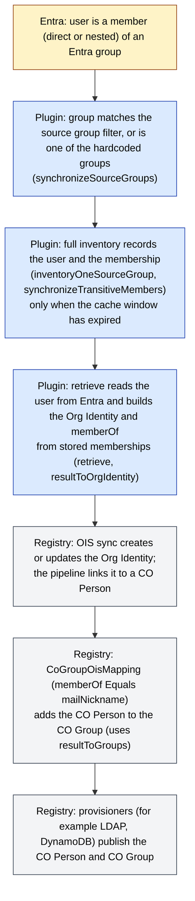
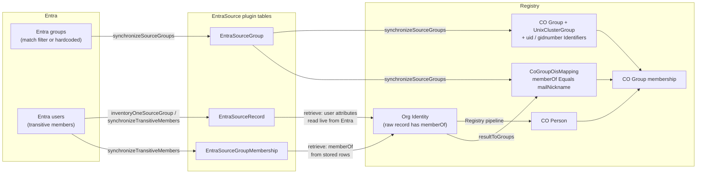

# How sync works

This page is for CILogon staff who run the Registry and administer the Missouri CO. It
explains how the EntraSource plugin decides which Entra users exist, what it stores,
which Registry objects it creates, and when changes in Entra show up in the Registry.
Use it to explain or troubleshoot what you see without reading the code.

Code is cited by file and function. Unless noted, the file is
`Model/EntraSourceBackend.php`. For the Graph endpoints and permissions the plugin uses,
see [Entra contract](entra-contract.md). For what each configuration field means, see
[Configuration](configuration.md). For Missouri-specific hardcoded values and behaviors
that may surprise you, see [Assumptions and known gaps](assumptions-and-gaps.md).

## The short version

- The plugin is an Organizational Identity Source (OIS). The Registry asks it for an
  inventory (a list of user keys), then retrieves each user by key.
- The inventory is the set of Entra users who are transitive members of the
  "source groups": the Entra groups that match the configured source group filter,
  plus three groups that are always added (see
  [Assumptions and known gaps](assumptions-and-gaps.md#three-groups-that-are-always-added)).
- The plugin stores what it finds in its own tables: source groups, source records
  (one per user), and source group memberships.
- A full inventory against Entra runs at most once per cache window. Between full
  inventories, the plugin answers from its stored tables.
- When the Registry retrieves a user, the plugin reads the user's attributes live from
  Entra, but builds the user's `memberOf` list from the stored memberships.
- For each source group the plugin creates a CO Group and a mapping from `memberOf` to
  that CO Group. The Registry uses that mapping to put the CO Person into the CO Group.

## End-to-end chain

Steps B to D are done by this plugin. Steps E to G are done by the Registry using its
own configuration (OIS sync settings, the pipeline, and provisioning targets); the plugin
only supplies the data and the CoGroupOisMapping. Step A is in Entra.

## Data the plugin stores

The plugin stores sync state in these tables of its own. Together they are the "cache"
that the rest of this page refers to. (The plugin's other table, for Extension
Properties, holds configuration only.)

| Table / model | One row per | Key fields |
| ------------- | ----------- | ---------- |
| EntraSourceGroup | source group, per EntraSource | `mail_nickname`, `graph_id` (Entra group object id), `gidnumber` |
| EntraSourceRecord | Entra user known to the plugin | `graph_id` (Entra user object id) |
| EntraSourceGroupMembership | (source group, source record) pair | `entra_source_group_id`, `entra_source_record_id` |
| EntraSource (config row) | EntraSource | `inventory_cache_start` (time the last full inventory started) |

The models are in `Model/EntraSourceGroup.php`, `Model/EntraSourceRecord.php`,
`Model/EntraSourceGroupMembership.php`, and `Model/EntraSource.php`.

## Inventory

The Registry calls `inventory()` to get the list of user keys. Each key is an Entra user
object id (the `graph_id` of an EntraSourceRecord).

### Step 1: is the cache still valid?

If "use source groups" is on, `inventory()` first calls `inventoryCacheValid()`. The
cache is valid when `inventory_cache_start` is set and `inventory_cache_start` plus
`max_inventory_cache` minutes is still in the future. If it is valid, `inventory()`
returns `inventoryFromCache()` and talks to Entra not at all.

`inventoryFromCache()` returns the `graph_id` of every stored EntraSourceRecord. (It does
not filter by EntraSource; see
[Assumptions and known gaps](assumptions-and-gaps.md#inventory-is-not-scoped-to-one-entrasource).)

The window is measured from the **start** of the last full inventory, because
`recordInventoryStart()` writes `inventory_cache_start` before any Entra calls are made.
With `max_inventory_cache` set to 0, the cache is never valid and every call does a full
inventory.

### Step 2: full inventory

If the cache is not valid (or "use source groups" is off), `inventory()`:

1. Calls `recordInventoryStart()` to set `inventory_cache_start` to now.
2. Loads the configured server records (`apiConnect()`). The access token is obtained or refreshed when each Graph request is made (`apiRequest()`).
3. Calls `inventoryBySourceGroups()` if "use source groups" is on, otherwise
   `inventoryAllUsers()`.

With "use source groups" off, `inventoryAllUsers()` returns an empty list, so the
inventory is empty. See
[Assumptions and known gaps](assumptions-and-gaps.md#all-users-inventory-is-not-implemented-the-source-group-filter-is-required).

### Step 3: synchronize the source groups

`inventoryBySourceGroups()` first calls `synchronizeSourceGroups()`, which:

1. Lists Entra groups matching the configured source group filter (following Graph
   paging), reading each group's object id, mailNickname, and gidNumber.
2. Adds the three hardcoded groups to that list.
3. For each group in the list, creates an EntraSourceGroup row keyed by mailNickname if
   none exists. An existing row is updated only if its stored `graph_id` or `gidnumber`
   is empty.
4. Deletes any EntraSourceGroup row for this EntraSource whose mailNickname is not in the
   list. Its EntraSourceGroupMembership rows go with it. The CO Group and related
   objects are kept.
5. Makes sure each remaining source group has its Registry objects (see
   [Registry objects created for each source group](#registry-objects-created-for-each-source-group)).

Errors from the Graph group listing are not caught here, so a failure stops the
inventory.

### Step 4: inventory each source group

For each EntraSourceGroup, `inventoryBySourceGroups()` calls
`inventoryOneSourceGroup()`. It asks Graph for the group's transitive members that are
users (members of nested groups count), following paging until there are no more pages,
and collects their object ids.

If a Graph request for a group fails, `inventoryOneSourceGroup()` logs the error and
moves on to the next group. The stored memberships for the failed group are left as
they were.

It then calls `synchronizeTransitiveMembers()` with the list of member ids:

- For each member, `addSourceRecord()` finds or creates the EntraSourceRecord for that
  user, and an EntraSourceGroupMembership row is created if missing.
- Any EntraSourceGroupMembership row for this group whose user is not in the list is
  deleted.
- EntraSourceRecord rows are never deleted. See
  [Assumptions and known gaps](assumptions-and-gaps.md#source-records-are-never-removed).

### Step 5: return the list

After all groups are processed, `inventoryBySourceGroups()` returns
`inventoryFromCache()`, the `graph_id` of every stored EntraSourceRecord.

## Retrieve

The Registry calls `retrieve($id)` with an Entra user object id. `retrieve()`:

1. Loads the configured server records (`apiConnect()`).
2. Calls `inventory()`. If the cache window has not expired, this returns at once from
   the stored tables. If it has expired, a full inventory runs inside this retrieve.
3. Reads the user from Graph by object id, asking for `id`, `givenName`, `surname`,
   `mail`, `userPrincipalName`, and any configured extension properties.
4. Calls `addSourceRecord()` for the user, so a retrieved user always has an
   EntraSourceRecord afterwards (and is then in later inventories), even if the user is
   in no source group.
5. Builds `memberOf` from the stored EntraSourceGroupMembership rows for that record:
   the mailNickname of each source group, sorted. It does **not** ask Entra for the
   user's current groups. (The calls that would do that,
   `getFilteredSourceGroupsForSourceRecord()` and `syncMembershipsSourceRecord()`, are
   commented out in `retrieve()`.)
6. Adds `memberOf` to the raw record, then builds the Org Identity with
   `resultToOrgIdentity()`.

The sort in step 5 keeps the raw record the same when nothing has changed.

### What an Org Identity from an Entra user contains

Built by `resultToOrgIdentity()`:

| Org Identity part | Value | Present when |
| ----------------- | ----- | ------------ |
| Affiliation | `member` | always |
| Name (type official, primary) | given = `givenName`, family = `surname` | the user has `givenName` or `surname` |
| Email Address (type official, verified) | `mail` | the user has `mail` |
| Identifier, type SOR ID | Entra user object id | always |
| Identifier, type `upn` | `userPrincipalName` | always |
| Identifier, type from the Extension Property configuration | value of that extension property (first value if it is a list) | the user has a value for that property |

The raw record also carries `memberOf`, which the Registry reads through
`resultToGroups()` for group mapping (below). The fixed types are listed on
[Assumptions and known gaps](assumptions-and-gaps.md#missouri-specific-values).

### Why a new Entra member is not visible right away

Because `retrieve()` uses stored memberships, a change in Entra group membership reaches
the Registry only after a full inventory has run. A full inventory runs only when the
cache window (`max_inventory_cache` minutes from the start of the last full inventory)
has expired and something calls `inventory()`: the Registry's OIS sync, or a
`retrieve()`.

So, after a user is added to a source group in Entra:

- Until the window expires, `inventory()` keeps returning the stored list, which does not
  include the user (unless the plugin already had a record for them), and `retrieve()`
  for an existing user returns the old `memberOf`.
- The first `inventory()` call after the window expires does a full inventory and stores
  the new record and membership.
- The next Registry sync that retrieves the user then sees the new `memberOf`, and the
  Registry updates CO Group membership.

The same delay applies to removals: a user removed from an Entra group keeps the
`memberOf` value until the next full inventory deletes the stored membership.

## Search

The Registry calls `search()` when someone searches the source, for example during
enrollment or a manual Org Identity link. `searchableAttributes()` offers only `mail`.

`search()`:

1. Asks Graph for users whose `mail` equals the given value, and uses only the first
   match.
2. If "use source groups" is on, calls `synchronizeSourceGroups()`, then
   `getFilteredSourceGroupsForSourceRecord()` to ask Graph live for the user's
   transitive group memberships, kept only where they match a stored source group. If
   none match, the search returns nothing.
3. Returns the Org Identity built by `resultToOrgIdentity()` from the Graph record,
   keyed by the Entra user object id. The search result has no `memberOf`.

Two consequences:

- The group check in search is live, but `retrieve()` uses stored memberships. A user
  just added in Entra can be found by search before the next full inventory, and the
  following retrieve can still show an empty or old `memberOf`.
- Because step 2 calls `synchronizeSourceGroups()`, a search can create or delete source
  groups and create Registry objects. See
  [Assumptions and known gaps](assumptions-and-gaps.md#search-synchronizes-source-groups).

## Registry objects created for each source group

Each time `synchronizeSourceGroups()` runs (every full inventory, and every search with
"use source groups" on), it makes sure each EntraSourceGroup has these objects in the CO
that owns the OIS:

| Object | Values | Created or changed when |
| ------ | ------ | ----------------------- |
| CO Group | name = mailNickname, type `Clusters`, not open, status Active | No CO Group with that name exists in the CO. An existing CO Group with the same name is used as is. |
| UnixClusterGroup | links the CO Group to the configured Unix Cluster (`unix_cluster_id`) | No UnixClusterGroup exists for that CO Group and Unix Cluster. |
| CoGroupOisMapping | OIS = this source, attribute `memberOf`, comparison Equals, pattern = mailNickname, target = the CO Group | The CO Group has no CoGroupOisMapping at all. If it already has any mapping, none is added. |
| Identifier, type `uid` | mailNickname | No active `uid` Identifier on the CO Group, or its value differs. A differing value is overwritten. |
| Identifier, type `gidnumber` | the source group's gidNumber | The source group has a stored gidNumber, and there is no active `gidnumber` Identifier or its value differs. |

A source group with no gidNumber value gets **no** `gidnumber` Identifier: the code
skips that step for the group. Where the gidNumber comes from, and why a changed value is
not picked up, is on
[Assumptions and known gaps](assumptions-and-gaps.md#gidnumber-extension-property-name).

When a source group disappears, none of these objects is deleted. See
[Assumptions and known gaps](assumptions-and-gaps.md#co-groups-are-kept-when-a-source-group-disappears).

### How memberOf puts a CO Person into the CO Group

The plugin provides two things for group mapping:

- `groupableAttributes()` tells the Registry that this source offers one attribute for
  group mapping, `memberOf`.
- `resultToGroups()` turns the `memberOf` list in the raw record from `retrieve()` into
  values of the `memberOf` attribute.

The CoGroupOisMapping created above says "if `memberOf` equals this group's
mailNickname, the person belongs in this CO Group". When the Registry syncs an Org
Identity from this source, it compares the `memberOf` values with the source's
CoGroupOisMappings and adds or removes the linked CO Person's membership in each mapped
CO Group; see the COmanage Registry technical manual on
[Organizational Identity Sources](https://spaces.at.internet2.edu/display/COmanage/Organizational+Identity+Sources)
and
[Organizational Identity Source Plugins](https://spaces.at.internet2.edu/display/COmanage/Organizational+Identity+Source+Plugins).

## Data-flow diagram

## Functions cited on this page

All in `Model/EntraSourceBackend.php`: `inventory()`, `inventoryCacheValid()`,
`inventoryFromCache()`, `recordInventoryStart()`, `inventoryAllUsers()`,
`inventoryBySourceGroups()`, `synchronizeSourceGroups()`, `inventoryOneSourceGroup()`,
`synchronizeTransitiveMembers()`, `addSourceRecord()`, `apiConnect()`, `retrieve()`,
`resultToOrgIdentity()`, `getFilteredSourceGroupsForSourceRecord()`,
`syncMembershipsSourceRecord()`, `search()`, `searchableAttributes()`,
`groupableAttributes()`, `resultToGroups()`.
