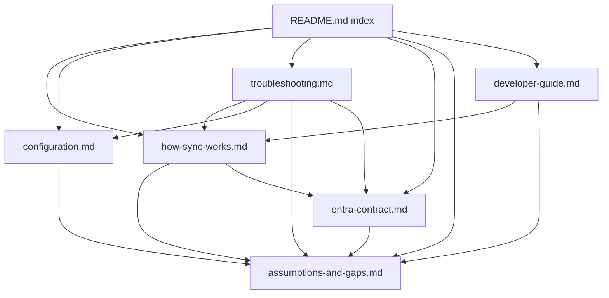
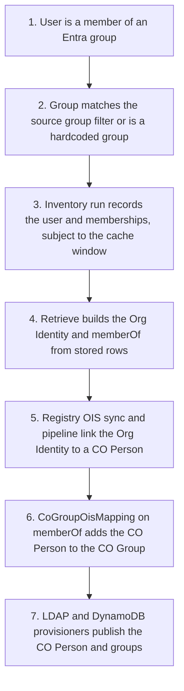

# EntraSource Documentation Set - Plan

## Goal Capsule

- **Objective:** CILogon staff can explain and troubleshoot the EntraSource plugin's current behavior, from Entra through Registry to provisioning, without asking the plugin author or reading the code.
- **Means:** Replace `README.md` with a short overview and index over a `docs/` set of task-oriented pages (KTD1).
- **Product authority:** The plugin author (repository owner) decides scope and accepts the docs. Product Contract R-IDs win on what the docs must say; KTDs win on how they are written.
- **Execution profile:** Documentation only. No PHP, schema, or view file changes (Scope Boundaries).
- **Stop conditions:** Stop and report if writing a page shows that a Product Contract statement about current behavior is false, or that a requirement cannot be met without a code change.
- **Who finishes:** The implementing agent writes the pages and opens a pull request on `cilogon/EntraSource` from the `bot` remote per `CLAUDE.md`; the plugin author reviews and merges.
- **Open blockers:** None.

---

## Product Contract

### Summary

A documentation set for the EntraSource OIS plugin, written for CILogon staff who operate the Registry and administer the Missouri CO. A short README indexes a `docs/` set: configuration, how the sync works, what the plugin expects from Entra, troubleshooting, Missouri-specific assumptions and known gaps, and developer internals.

### Problem Frame

The only documentation is a partial `README.md` that stops at `inventory()` and leaves retrieval, search, caching, and credentials blank. When CILogon staff ask why a user is missing from the Registry, missing from a CO Group, or did not provision to LDAP or DynamoDB, the author answers by re-reading the code.

The University of Missouri is changing its Entra configuration, and the plugin will likely have to change in response. Before that work starts, the people who run the Registry need to understand what the plugin does today and which of its behaviors depend on Missouri's current Entra setup. Several of those behaviors are hardcoded rather than configured, so they are invisible from the Registry UI.

### Key Decisions

- **Primary readers are CILogon staff; plugin developers are secondary.** CILogon staff both operate the Registry and administer the Missouri CO, so operator and CO-admin needs are one audience. Governs R1, R15. (session-settled: user-directed -- chosen over writing primarily for Missouri CO administrators or Entra tenant admins: CILogon staff do the CO administration and field the support questions.)
- **README plus a `docs/` set, one page per reader task.** Pages that will change with the Entra work (Entra contract, assumptions and gaps) can be revised in isolation. Governs R1, R2. (session-settled: user-directed -- chosen over a single long README and over troubleshooting-first runbooks with partial reference: the expected Entra-driven changes favor separately maintained pages.)
- **Document current behavior as-is, with Missouri-specific and unfinished parts flagged.** No code changes in this work. Governs R4, R5. (session-settled: user-directed -- chosen over fixing the hardcoded values first: the coming Entra changes will rework those parts anyway.)
- **Troubleshooting covers the whole chain; only the plugin is explained in depth.** Downstream Registry steps appear as checkpoints. Governs R12, R13. (session-settled: user-directed -- chosen over plugin-only scope and over documenting the Missouri pipeline and provisioners in depth: the real support questions cross into provisioning, but those components are documented and configured elsewhere.)
- **A consolidated Entra contract page.** It is the reference for judging the impact of Missouri's Entra changes. Governs R11. (session-settled: user-directed -- chosen over folding Entra dependencies into other pages and over deferring until the changes are known.)
- **Public-repo hygiene.** `cilogon/EntraSource` is public. Governs R16. (session-settled: user-approved -- proposed in the scoping synthesis and confirmed.)
- **Docs stay current through a CLAUDE.md rule.** Governs R17. (session-settled: user-approved -- proposed in the scoping synthesis and confirmed.)

### Requirements

**Structure**

- R1. `README.md` becomes a short overview of the plugin and its audience, with an index linking every `docs/` page.
- R2. The `docs/` set has one page each for: configuration, how the sync works, the Entra contract, troubleshooting, Missouri-specific assumptions and known gaps, and developer internals.
- R3. Each fact has one home page; other pages link to it rather than restating it.

**Accuracy**

- R4. Every behavioral statement describes the code on `main` at the time of writing.
- R5. The assumptions-and-gaps page lists each hardcoded Missouri value and unfinished path, what it does, and where in the code it lives.

**Configuration**

- R6. The configuration page covers every field an administrator sets on an EntraSource and on its extension properties, and what each field changes in behavior.
- R7. The configuration page covers prerequisites: the Registry OAuth2 server and HTTP server records the plugin requires, and the Unix Cluster dependency.

**How the sync works**

- R8. The sync page explains inventory end to end: source group selection, transitive membership, record tracking, the inventory cache window, and how retrieve uses data stored by the last inventory.
- R9. The sync page states which Registry objects the plugin creates for each Entra source group and what an Org Identity built from an Entra user contains.
- R10. The sync page includes a data-flow diagram from Entra groups and users to CO Group membership.

**Entra contract**

- R11. The Entra contract page lists every Graph endpoint called, the application permissions those calls need, the user and group attributes and extension properties read, and the naming and membership assumptions; for each, it states what changes in the Registry if Missouri changes it.

**Troubleshooting**

- R12. The troubleshooting page has a step-by-step diagnosis for each of: why user X is not in the Registry; why user X is not in CO Group Y; why user X did not provision to LDAP or DynamoDB.
- R13. Steps outside the plugin (OIS sync to CO Person, CO Group membership, the LDAP and DynamoDB provisioners) appear as checkpoints naming what to look at and where it is configured in the Registry, without explaining those components in depth.
- R14. The diagnoses account for timing: memberships reflect the last inventory run and the inventory cache window.

**Developer internals**

- R15. The developer page covers the plugin's data model, how the backend is organized, Graph client behavior (paging, throttling, error handling), and the open TODOs, linking to the assumptions-and-gaps page for their effect.

**Public repository and upkeep**

- R16. The docs contain no Missouri operational details beyond what the code already holds: no hostnames, credentials, secrets, or names of Missouri pipeline and provisioner configurations.
- R17. `CLAUDE.md` gains a rule that a change in plugin behavior updates the affected `docs/` pages in the same pull request.

### Acceptance Examples

- AE1. **Covers R12, R14.**
  - **Given:** a user was added in Entra to a group matching the source group filter after the last inventory, and the cache window has not expired.
  - **When:** a staff member follows the "not in the Registry" diagnosis.
  - **Then:** they identify inventory timing and the cache window as the cause and know what to do about it.
- AE2. **Covers R11, R12.**
  - **Given:** an Entra source group has no value in the gidNumber extension.
  - **When:** a staff member follows the "did not provision" diagnosis for a member of that group.
  - **Then:** they find that the plugin creates the CO Group without a gidnumber identifier and trace the provisioning symptom to that.
- AE3. **Covers R5, R12.**
  - **Given:** a user belongs to one of the hardcoded admin groups (for example `nic-cluster-admins`).
  - **When:** a staff member asks why that group exists in the Registry even though it does not match the source group filter.
  - **Then:** the assumptions-and-gaps page explains that the plugin always adds those groups.
- AE4. **Covers R11.**
  - **Given:** Missouri announces it will rename or replace the gidNumber extension property.
  - **When:** a staff member consults the Entra contract page.
  - **Then:** they can state which Registry objects stop getting gidNumbers and that a code change is required, because the extension name is hardcoded.

### Success Criteria

- A CILogon staff member given a real "why isn't user X in group Y" case traces it to its cause using only the docs, without asking the author or opening the code.

### Scope Boundaries

- No code changes, including making the hardcoded values configurable or implementing inventory of all users.
- No guide aimed at Entra tenant administrators; the Entra contract page is written for CILogon staff.
- No in-depth documentation of the Registry pipeline, CO Person lifecycle, or the LDAP and DynamoDB provisioners.
- No Missouri operational runbook (hostnames, credentials, deployment procedures).

### Dependencies / Assumptions

- The Graph application permissions are not declared anywhere in the code; the Entra contract page infers them from the endpoints called. Assumption: confirm them against Missouri's actual app registration before publishing.
- How and how often the Registry runs the OIS inventory for this source is configured in the Registry, not the plugin; the docs describe it as a checkpoint per R13.

### Outstanding Questions

**Deferred to Planning**

- Which Registry Technical Manual pages each downstream checkpoint links to; chosen during implementation per KTD6.

### Sources / Research

- `README.md` -- current partial documentation.
- `Model/EntraSourceBackend.php` -- inventory, cache, retrieve, search, group synchronization, Graph client, and the hardcoded values (gidNumber extension near line 841; admin groups near line 866; Org Identity types near lines 574-608; `inventoryAllUsers()` near line 345).
- `Model/EntraSource.php` -- configuration model and the UnixCluster dependency.
- `Config/Schema/schema.xml` -- plugin tables.
- `View/EntraSources/fields.inc`, `View/EntraSourceExtensionProperties/fields.inc`, `Lib/lang.php` -- administrator-facing fields and labels.
- COmanage Registry Organizational Identity Source Plugins documentation: https://spaces.at.internet2.edu/display/COmanage/Organizational+Identity+Source+Plugins

---

## Planning Contract

**Product Contract preservation:** Product Contract unchanged; deferred questions on page names and verification resolved by KTD1 and KTD4.

### Key Technical Decisions

- KTD1. **Six pages under `docs/`, indexed from `README.md`.** File names: `docs/configuration.md`, `docs/how-sync-works.md`, `docs/entra-contract.md`, `docs/troubleshooting.md`, `docs/assumptions-and-gaps.md`, `docs/developer-guide.md`. The README index lists them in reader order (sync, configuration, troubleshooting, Entra contract, assumptions and gaps, developer guide) and does not list `docs/plans/`. Implements R1, R2.
- KTD2. **Cite code by repo-relative path plus function name, not line number.** For example `Model/EntraSourceBackend.php`, `synchronizeSourceGroups()`. Line numbers drift with every edit; function names survive the Entra-driven changes the docs exist to support. Serves R4, R5, R15.
- KTD3. **Diagrams are mermaid blocks.** GitHub renders them on `cilogon/EntraSource`, and they stay diffable text. Serves R10.
- KTD4. **Verify by a claim check, not tests.** The repo has no test suite and the deliverable is prose. Every behavioral statement is checked against the cited code by a reviewer who did not write it, and the acceptance examples are walked through using only the docs. Serves R4 and the Success Criteria.
- KTD5. **Graph permissions are documented as inferred least-privilege application permissions.** Each endpoint's required permission comes from the Microsoft Graph reference for that endpoint, labeled as inferred until confirmed against Missouri's app registration (Dependencies / Assumptions). Serves R11.
- KTD6. **Registry behavior outside the plugin is linked, not restated.** OIS sync modes, pipelines, CO Group membership from OIS mappings, and the LDAP and DynamoDB provisioners are described in one or two sentences per checkpoint with a link to the COmanage Registry 4.x Technical Manual. Implements R13 and keeps R16.
- KTD7. **Each fact has one owning page; others link to it** (R3). Owners: Missouri-specific values and TODOs on `assumptions-and-gaps.md`; Graph endpoints, attributes, and permissions on `entra-contract.md`; created Registry objects and timing on `how-sync-works.md`; field meanings on `configuration.md`.

### High-Level Technical Design

Page ownership and links. Arrows mean "links to for detail".

The chain the troubleshooting page walks (R12, R13). Steps 1-4 are the plugin; steps 5-7 are Registry checkpoints (KTD6).

### Assumptions

- Missouri's Entra app registration grants application (not delegated) Graph permissions, since the plugin uses the client credentials grant.
- The README's current model descriptions are a starting point only; at least one is wrong (it says source records are deleted when no longer in any group, and the code never deletes them), so each is checked against the code before reuse on `developer-guide.md`.
- How the Registry schedules OIS inventory for this source (sync mode, job schedule) is read from the Registry 4.x Technical Manual during implementation, not from Missouri's configuration.

---

## Implementation Units

### U1. Assumptions and known gaps page

**Goal:** One page that lists every Missouri-specific hardcoded value and unfinished path, what it does, and where it lives.

**Requirements:** R5, R16; AE3.

**Dependencies:** None.

**Files:**
- Create: `docs/assumptions-and-gaps.md`

**Approach:**
1. Inventory every `TODO` comment and hardcoded literal in `Model/EntraSourceBackend.php` and `Model/EntraSource.php`.
2. For each, state the current behavior, its effect on a CILogon staff member's view of the Registry, and the code location (KTD2).
3. Cover at least: the hardcoded gidNumber extension property; the three always-added groups with their gidNumbers; hardcoded affiliation, name, email, and `upn` identifier types; the unimplemented all-users inventory and the required source group filter; the UnixCluster plugin dependency.
4. Also cover behavior that carries no `TODO` marker: a stored gidNumber is set once and never refreshed from Entra; `inventoryFromCache()` is not scoped to one EntraSource; source records are never removed when a user leaves every group (the current `README.md` says otherwise); CO Groups and their mappings are kept when a source group disappears; `search()` synchronizes source groups as a side effect.
5. Group entries by "Missouri-specific values" and "Unfinished or assumed behavior".

**Patterns to follow:** `README.md` for the plugin's existing terminology (Entra source group, source record).

**Test scenarios:**
- Covers AE3. A reader asked why `nic-cluster-admins` exists without matching the filter finds the answer on this page.
- Every `TODO` in `Model/` appears on the page or is listed as not relevant to readers, with a reason.
- No value on the page goes beyond what the code holds (R16).

**Verification:** Every `TODO` and hardcoded literal found by grepping `Model/` has an entry; that grep is a floor, and the untagged behaviors in Approach step 4 are also present.

### U2. How the sync works page

**Goal:** Explain, end to end, how Entra groups and users become Registry Org Identities and CO Groups, including timing.

**Requirements:** R8, R9, R10; AE1, AE2.

**Dependencies:** U1 (links to it for Missouri-specific behavior).

**Files:**
- Create: `docs/how-sync-works.md`

**Approach:**
1. Describe inventory: source group sync (`synchronizeSourceGroups()`), transitive members per group (`inventoryOneSourceGroup()`), source records and memberships, the inventory cache (`inventoryCacheValid()`), and what happens when source groups are off.
2. Describe retrieve: lookup by Entra object id, Org Identity contents from `resultToOrgIdentity()`, and `memberOf` built from stored membership rows rather than a live query.
3. Describe search: by mail only, first match, source-group restriction.
4. List the Registry objects created per Entra source group (CO Group, Unix cluster group, CoGroupOisMapping, uid and conditional gidnumber identifiers).
5. Include the chain diagram from the High-Level Technical Design, adapted for readers (KTD3).

**Patterns to follow:** The COmanage OIS plugin documentation linked from `README.md` for interface names.

**Test scenarios:**
- Covers AE1. Using this page, a reader can explain why a newly added Entra member is not visible until the next inventory after the cache window.
- Covers AE2. The page states that a group without a gidNumber value gets no gidnumber identifier.
- Each named function exists in the cited file.

**Verification:** A reviewer tracing each paragraph to its cited function finds no contradiction.

### U3. Configuration page

**Goal:** Describe every administrator-facing setting and its prerequisites.

**Requirements:** R6, R7.

**Dependencies:** U1.

**Files:**
- Create: `docs/configuration.md`

**Approach:**
1. Prerequisites: the Registry OAuth2 server (client credentials) and HTTP server (Graph base URL) records, the UnixCluster plugin and a Unix cluster.
2. One entry per EntraSource field from `View/EntraSources/fields.inc` and `Lib/lang.php`: label as shown in the UI, meaning, effect on sync, default, and gotchas (for example an empty source group filter).
3. Extension properties from `View/EntraSourceExtensionProperties/fields.inc`: what an entry does and how it becomes an Identifier on the Org Identity.
4. Use a table for fields (five or more uniform items).

**Patterns to follow:** UI labels exactly as in `Lib/lang.php`.

**Test scenarios:**
- Every input in both `fields.inc` files has a row.
- Each row's UI label matches `Lib/lang.php`.

**Verification:** Field list cross-checked against `Config/Schema/schema.xml` columns for `entra_sources` and `entra_source_extension_properties`.

### U4. Entra contract page

**Goal:** One reference listing what the plugin depends on from Entra and what breaks if Missouri changes it.

**Requirements:** R11, R16; AE2, AE4.

**Dependencies:** U1.

**Files:**
- Create: `docs/entra-contract.md`

**Approach:**
1. List each Graph call in `Model/EntraSourceBackend.php` (token request, group list with filter, transitive members, user transitive memberOf, user get, user search) with its purpose.
2. For each, give the inferred least-privilege application permission from the Microsoft Graph reference (KTD5).
3. List user attributes, group attributes, and extension properties read, and the assumptions (mailNickname as group name, transitive membership, mail as search key, throttling handling).
4. For each dependency, state the Registry-visible effect of a change on the Entra side.
5. For the gidNumber extension, establish from the Microsoft Graph reference how `/groups` responds to a `$select` naming a missing extension property, and state whether that stops the inventory, since `inventoryBySourceGroups()` does not catch a failure there.

**Test scenarios:**
- Covers AE4. A reader can state that renaming the gidNumber extension needs a code change, that source groups already stored keep their existing gidNumber (stored values are never refreshed from Entra), and that source groups first seen after the change get no gidnumber identifier.
- Every `apiRequest()` call site maps to a row.
- Every permission is labeled inferred.

**Verification:** A grep for `apiRequest(` in `Model/EntraSourceBackend.php` matches the endpoint list.

### U5. Troubleshooting page

**Goal:** Step-by-step diagnoses for the three questions CILogon staff ask.

**Requirements:** R12, R13, R14; AE1, AE2, AE3; Success Criteria.

**Dependencies:** U1, U2, U3, U4.

**Files:**
- Create: `docs/troubleshooting.md`

**Approach:**
1. One section per question, each an ordered checklist following the chain diagram.
2. Plugin steps link to the owning page (KTD7) rather than re-explaining.
3. Registry steps are checkpoints with a manual link (KTD6) and no Missouri configuration names (R16).
4. Put timing checks (last inventory, cache window) early in each checklist (R14).
5. Each checklist includes a plugin-log step: a Graph failure for one source group is logged and that group is skipped, leaving its memberships stale with no sign in the Registry UI. Log message meanings are owned by `developer-guide.md` (KTD7).

**Test scenarios:**
- Covers AE1. Following "not in the Registry" for a user added after the last inventory leads to the timing step.
- Covers AE2. Following "did not provision" for a member of a group without a gidNumber leads to the missing gidnumber identifier.
- Covers AE3. Following "not in CO Group Y" for a hardcoded group links to U1's page.
- Following "not in CO Group Y" when that group's Graph call failed during the last inventory leads to the plugin-log step.
- Every checklist step either cites a plugin page or names a Registry checkpoint with a link.

**Verification:** A reader who did not write the docs walks AE1-AE3 using only `docs/` and reaches the stated cause.

### U6. Developer guide page

**Goal:** Give a future maintainer the data model, code organization, and Graph client behavior.

**Requirements:** R15.

**Dependencies:** U1, U2.

**Files:**
- Create: `docs/developer-guide.md`

**Approach:**
1. Data model: the five plugin tables from `Config/Schema/schema.xml` and their models, reusing the checked README descriptions.
2. Backend organization: the OIS interface methods and the helpers they call.
3. Graph client: `apiConnect()`, `apiRequest()` paging and 429 retry behavior, error handling, and the plugin's log messages (prefix, level, and which messages mark a skipped source group, throttling, or a failed Graph call).
4. Open TODOs: one line each, linking to `assumptions-and-gaps.md` for effect (KTD7).

**Test scenarios:**
- Each table in `schema.xml` is described.
- Each public OIS method in `Model/EntraSourceBackend.php` is named.

**Verification:** Claim check per KTD4.

### U7. README index and CLAUDE.md upkeep rule

**Goal:** Make the docs discoverable and keep them current.

**Requirements:** R1, R17.

**Dependencies:** U1-U6.

**Files:**
- Modify: `README.md`
- Modify: `CLAUDE.md`

**Approach:**
1. Replace `README.md` with a short overview (what the plugin does, who the docs are for) and the KTD1 index.
2. Add to `CLAUDE.md` a rule that a change to plugin behavior updates the affected `docs/` pages in the same pull request, and list `docs/` in its directory section.

**Test expectation:** none -- index and instructions only; covered by the link check in the Verification Contract.

**Verification:** Every link in `README.md` resolves to an existing page.

---

## Verification Contract

There is no automated test suite and this change touches no PHP.

| Check | How | Proves |
|---|---|---|
| Scope | The diff touches only `README.md`, `CLAUDE.md`, and `docs/*.md` | Scope Boundaries (no code changes) |
| Links | Every relative markdown link in `README.md` and `docs/*.md` resolves to an existing file | R1, R3 |
| Code references | Every cited file exists and every cited function name appears in it | R4, KTD2 |
| Claim check | A fresh-context reviewer verifies each behavioral statement against the cited code | R4, KTD4 |
| Walkthrough | AE1-AE4 walked using only `docs/` | Success Criteria |
| Public-repo hygiene | No hostnames, credentials, secrets, or Missouri pipeline/provisioner names | R16 |
| Mermaid | Diagrams use plain `flowchart` syntax that GitHub renders | R10, KTD3 |

---

## Definition of Done

- U1-U7 complete and each unit's Verification holds.
- Every check in the Verification Contract passes.
- `README.md` no longer contains the unfinished sections it had.
- No draft, scratch, or abandoned page left in `docs/` other than the six pages and `docs/plans/`.
- Changes are on a feature branch, never `main`, and shipped per `CLAUDE.md`.
