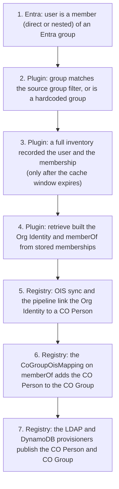

# Troubleshooting

This page is for CILogon staff who run the Registry and administer the Missouri CO. It
gives a step-by-step diagnosis for the three questions that come up most:

- [User X is not in the Registry](#user-x-is-not-in-the-registry)
- [User X is not in CO Group Y](#user-x-is-not-in-co-group-y)
- [User X did not provision to LDAP or DynamoDB](#user-x-did-not-provision-to-ldap-or-dynamodb)

Each diagnosis is an ordered checklist. Work through it from the top and stop at the
first step that fails: that step is the cause. Steps about the plugin link to the page
that explains the behavior. Steps about the Registry itself (OIS sync, pipelines, group
mapping, provisioning) are checkpoints: they say what to look at and where it is
configured, and link to the COmanage Registry
[technical manual](https://spaces.at.internet2.edu/display/COmanage/COmanage+Registry+Technical+Manual)
for the details.

Related pages: [How sync works](how-sync-works.md),
[Configuration](configuration.md), [Entra contract](entra-contract.md),
[Assumptions and known gaps](assumptions-and-gaps.md), and
[Developer guide](developer-guide.md) (for the meaning of plugin log messages).

## Start here: the chain

A user ends up in an LDAP or DynamoDB group only if every link in this chain holds.
Steps 2 to 4 are the plugin; steps 5 to 7 are the Registry. The full version, with the
functions involved, is in [How sync works](how-sync-works.md#end-to-end-chain).

## Before you start

Have these at hand:

- The user's Entra object id, user principal name, or email address. The object id is
  the user's key in the plugin and appears on the Org Identity as the SOR ID Identifier
  ([what an Org Identity contains](how-sync-works.md#what-an-org-identity-from-an-entra-user-contains)).
- For a group question, the CO Group name. For a group the plugin manages, the CO Group
  name is the Entra group's mailNickname
  ([Entra contract](entra-contract.md#mailnickname-is-the-groups-name-and-identity)).
- Access to the Registry error log. Every message the plugin writes goes there, prefixed
  with `EntraSourceBackend ID <n>:`. See the [Developer guide](developer-guide.md) for
  what each message means.

Two facts drive most cases, so every checklist below checks them first:

1. **Timing.** Group memberships in the Registry reflect the **last full inventory**, not
   Entra right now. A full inventory runs only when the inventory cache window
   ("Maximum inventory cache lifetime", in minutes, measured from the **start** of the
   last full inventory) has expired and a sync or retrieve calls the plugin. Until then,
   the plugin answers from its stored tables. See
   [Why a new Entra member is not visible right away](how-sync-works.md#why-a-new-entra-member-is-not-visible-right-away)
   and [Maximum inventory cache lifetime](configuration.md#maximum-inventory-cache-lifetime).
2. **Silent skips.** If the Graph call for one source group's members fails during an
   inventory, the plugin logs the error and skips that group. Its stored memberships stay
   as they were, so they go stale, and nothing in the Registry UI shows it. If the Graph
   call that lists the source groups fails, the whole inventory stops. See
   [When a Graph call fails](entra-contract.md#when-a-graph-call-fails).

### How to find when the last full inventory started

- In the Registry error log, a full inventory starts where the plugin logs
  `inventory cache is invalid` followed by `inventory called`. A call answered from the
  cache logs `inventory cache is valid` instead. The [Developer guide](developer-guide.md)
  lists these messages.
- The start time is also stored in the `inventory_cache_start` column of the plugin's
  `entra_sources` table (with the Registry's table prefix). It is not shown in the UI;
  see the note under [EntraSource fields](configuration.md#entrasource-fields).

Add the configured "Maximum inventory cache lifetime" to that start time. Before that
moment, no change made in Entra after the start time can reach the Registry.

## User X is not in the Registry

Symptom: no Org Identity from the EntraSource source for the user, or no CO Person.

1. **Timing: was the user added in Entra after the last full inventory started?**
   Find the start of the last full inventory
   ([how](#how-to-find-when-the-last-full-inventory-started)). If the user was added to
   the Entra group after that, and the cache window has not expired, the plugin's
   inventory does not include the user yet. This is expected.
   *What to do:* wait until the window expires and the next sync job runs. The first
   inventory call after expiry runs a full inventory and records the user
   ([How sync works](how-sync-works.md#why-a-new-entra-member-is-not-visible-right-away)).
   A shorter cache lifetime makes this happen sooner, at the cost of more Graph calls
   ([Configuration](configuration.md#maximum-inventory-cache-lifetime)).

2. **Registry checkpoint: did a sync job run after the window expired, and is the
   source in Full sync mode?** New users are created from the plugin's inventory only
   when the Organizational Identity Source's sync mode is Full. Look at the source's
   sync mode and status on its Organizational Identity Source page in the CO, and at
   the CO's Jobs list for the sync job of this source: when it ran and whether its
   history records show errors (an inventory failure is recorded there). Scheduled syncs
   are run by the Registry Job Shell. See
   [Organizational Identity Sources](https://spaces.at.internet2.edu/display/COmanage/Organizational+Identity+Sources)
   and [Registry Job Shell](https://spaces.at.internet2.edu/display/COmanage/Registry+Job+Shell).

3. **Plugin log: did the last inventory fail?** In the Registry error log, look at the
   plugin's messages around the last full inventory.
   - A failure listing the source groups stops the whole inventory. The cache window
     still restarts, so the next attempt waits for the window again.
   - A failure for one source group's members means that group was skipped: users who
     are only in that group are not recorded, and its stored memberships stay stale.
   - A token or permission problem makes every call fail
     ([Authentication](entra-contract.md#authentication),
     [Permissions for each call](entra-contract.md#permissions-for-each-call)).

   See [When a Graph call fails](entra-contract.md#when-a-graph-call-fails) for the
   effect, and the [Developer guide](developer-guide.md) for which messages mark each case.

4. **Configuration: is "Select Using Groups" on?** With it off, the inventory is always
   empty and no user is created by sync. See
   [Select Using Groups](configuration.md#select-using-groups) and
   [All-users inventory is not implemented](assumptions-and-gaps.md#all-users-inventory-is-not-implemented-the-source-group-filter-is-required).

5. **Entra: is the user a member of a source group?** Membership is transitive, so a
   member of a nested group counts, but only user objects are counted
   ([Membership is transitive](entra-contract.md#membership-is-transitive)). Check in
   Entra which groups the user is in.

6. **Plugin: does that group match the source group filter, or is it a hardcoded
   group?** Every source group has a CO Group of the same name in the CO, of type
   Clusters, with a group mapping on `memberOf`
   ([Registry objects created for each source group](how-sync-works.md#registry-objects-created-for-each-source-group)).
   If none of the user's Entra groups has such a CO Group, none of them is a source
   group: check the filter
   ([Entra group filter query parameter](configuration.md#entra-group-filter-query-parameter))
   and the [three hardcoded groups](assumptions-and-gaps.md#three-groups-that-are-always-added).
   A CO Group can outlive its source group, so its presence alone does not prove the
   group is still a source group
   ([CO Groups are kept when a source group disappears](assumptions-and-gaps.md#co-groups-are-kept-when-a-source-group-disappears)).

7. **Plugin: does retrieve fail for this user?** The Registry creates the Org Identity by
   calling retrieve with the user's object id. Retrieve fails for every user if a
   configured Schema Extension Property name is wrong, and for one user if that Entra
   object was deleted (for example, deleted and recreated, which gives a new object id).
   The failure appears in the sync job history and in the Registry error log. See
   [User attributes](entra-contract.md#user-attributes) and
   [Schema Extension Properties](configuration.md#schema-extension-properties).

8. **Registry checkpoint: is the Org Identity linked to a CO Person?** If the Org
   Identity exists but there is no CO Person, look at the pipeline attached to the
   Organizational Identity Source (set on the source's configuration page in the CO) and
   at its match and create settings. See
   [Registry Pipelines](https://spaces.at.internet2.edu/display/COmanage/Registry+Pipelines).

## User X is not in CO Group Y

Symptom: the user has a CO Person, but is not a member of CO Group Y (or is still a
member after being removed in Entra).

1. **Is Y a group this plugin manages?** A plugin-managed CO Group is named after an
   Entra group's mailNickname and has a group mapping for this source: attribute
   `memberOf`, comparison Equals, pattern Y
   ([Registry objects created for each source group](how-sync-works.md#registry-objects-created-for-each-source-group)).
   - If Y is `nic-cluster-admins`, `nic-cluster-admins-tier1-admin`, or
     `nic-software-installer`, it is one of the three hardcoded groups. Their Entra object
     id is fixed in the code, so if the Entra group was recreated with a new id, the
     member call for it fails and its memberships go stale. See
     [Three groups that are always added](assumptions-and-gaps.md#three-groups-that-are-always-added)
     and [Impact of Entra changes](entra-contract.md#impact-of-entra-changes).
   - If Y no longer matches the filter or was deleted in Entra, the plugin dropped the
     source group but kept the CO Group, and no user will be added to it again. See
     [CO Groups are kept when a source group disappears](assumptions-and-gaps.md#co-groups-are-kept-when-a-source-group-disappears).
   - If Y existed in the CO before the plugin saw the Entra group and already had a
     group mapping, the plugin did not add its own mapping
     ([Registry objects created for each source group](how-sync-works.md#registry-objects-created-for-each-source-group)).
     Check that a `memberOf` Equals Y mapping for this source exists.
   - If Y was renamed in Entra (new mailNickname), members move to a new CO Group with
     the new name ([Impact of Entra changes](entra-contract.md#impact-of-entra-changes)).

2. **Timing: did the membership change in Entra after the last full inventory started?**
   Find the start of the last full inventory
   ([how](#how-to-find-when-the-last-full-inventory-started)). The plugin builds the
   user's `memberOf` from memberships stored by the last full inventory. It does not ask
   Entra for the user's current groups. A user added to (or removed from) the Entra
   group after that start time keeps the old `memberOf` until the window expires, a full
   inventory runs, and a sync retrieves the user again. See
   [Retrieve](how-sync-works.md#retrieve) and
   [Why a new Entra member is not visible right away](how-sync-works.md#why-a-new-entra-member-is-not-visible-right-away).

3. **Plugin log: was Y skipped in the last inventory?** In the Registry error log, find
   the plugin's entry for inventorying source group Y during the last full inventory and
   check whether an exception was logged right after it. If so, the Graph call for Y's
   members failed, Y was skipped, and its stored memberships are those of an earlier
   inventory. Nothing in the Registry UI shows this. If the call that lists the source
   groups failed, the whole inventory stopped and no group was updated. See
   [When a Graph call fails](entra-contract.md#when-a-graph-call-fails) and the
   [Developer guide](developer-guide.md) for the messages.

4. **Is the user in the Registry from this source at all?** If there is no Org Identity
   from the EntraSource source linked to the CO Person, go to
   [User X is not in the Registry](#user-x-is-not-in-the-registry).

5. **Does the user's `memberOf` include Y?** The Registry keeps a copy of the record
   the plugin returned for each Org Identity (the source record), and an administrator
   can view it from the Org Identity. Its `memberOf` list holds the mailNicknames of
   the source groups the plugin has stored for the user. See
   [Organizational Identity Sources](https://spaces.at.internet2.edu/display/COmanage/Organizational+Identity+Sources).
   - **Y is missing:** the plugin has no stored membership. Check that the user is a
     transitive member of the Entra group
     ([Membership is transitive](entra-contract.md#membership-is-transitive)), then
     steps 2 and 3 again.
   - **Y is present:** the plugin did its part. Go on to step 6.

6. **Registry checkpoint: did group mapping run for this Org Identity?** The Registry
   applies the source's group mappings when it syncs an Org Identity that is linked to a
   CO Person, adding or removing membership in each mapped CO Group. Check that the Org
   Identity is linked to the CO Person, that the sync job ran after the source record
   changed, and that the job history shows no error for this record. The mappings are
   on the CO Group (and listed for the Organizational Identity Source). See
   [How memberOf puts a CO Person into the CO Group](how-sync-works.md#how-memberof-puts-a-co-person-into-the-co-group),
   [Organizational Identity Sources](https://spaces.at.internet2.edu/display/COmanage/Organizational+Identity+Sources),
   and
   [Organizational Identity Source Plugins](https://spaces.at.internet2.edu/display/COmanage/Organizational+Identity+Source+Plugins).

## User X did not provision to LDAP or DynamoDB

Symptom: the user, or the user's group membership, is missing from LDAP or DynamoDB.

Provisioning publishes what is in the Registry, so first make sure the Registry itself
is right.

1. **Timing and Registry state: is the CO Person in the Registry and in the CO Group?**
   If not, the cause is upstream. Use
   [User X is not in the Registry](#user-x-is-not-in-the-registry) or
   [User X is not in CO Group Y](#user-x-is-not-in-co-group-y). Both start with the
   timing check: memberships reflect the last full inventory and the cache window, so a
   recent Entra change may simply not have reached the Registry yet
   ([Why a new Entra member is not visible right away](how-sync-works.md#why-a-new-entra-member-is-not-visible-right-away)).

2. **Plugin log: are the user's groups current?** A source group whose member call failed
   in the last inventory was skipped and keeps stale memberships, which provisioning then
   publishes faithfully. A failure listing the source groups stops the whole inventory.
   Check the Registry error log as in
   [step 3 of the group checklist](#user-x-is-not-in-co-group-y); see
   [When a Graph call fails](entra-contract.md#when-a-graph-call-fails) and the
   [Developer guide](developer-guide.md).

3. **Plugin: does the CO Group have a `gidnumber` Identifier?** Open CO Group Y and look
   at its Identifiers. The plugin gives every source group a `uid` Identifier (the
   mailNickname). It adds a `gidnumber` Identifier **only** if the Entra group has a
   value in the gidNumber extension property. A group with no gidNumber in Entra gets a CO
   Group with no `gidnumber` Identifier, so anything that publishes the group's POSIX
   gidNumber has no value for it. See
   [Registry objects created for each source group](how-sync-works.md#registry-objects-created-for-each-source-group),
   [The gidNumber extension](entra-contract.md#the-gidnumber-extension), and
   [gidNumber extension property name](assumptions-and-gaps.md#gidnumber-extension-property-name).
   - *What to do:* set a gidNumber on the group in Entra. A source group stored without
     a gidNumber picks up the value at the next full inventory.
   - If the Identifier exists but its value differs from Entra, the stored value is never
     refreshed once set; see
     [A stored gidNumber is never refreshed from Entra](assumptions-and-gaps.md#a-stored-gidnumber-is-never-refreshed-from-entra).

4. **Plugin: is the CO Group attached to the right Unix Cluster?** The plugin links every
   source group's CO Group to the Unix Cluster set in the EntraSource configuration. If
   the configured cluster was changed later, older links stay in the old cluster. See
   [Unix Cluster](configuration.md#unix-cluster).

5. **Plugin and Registry checkpoint: does the CO Person have the Identifiers the
   provisioners need?** The plugin puts the SOR ID, the `upn` Identifier, and one
   Identifier per configured Schema Extension Property on the Org Identity. A user with
   no value for an extension property gets no Identifier for it
   ([How a property becomes an Identifier](configuration.md#how-a-property-becomes-an-identifier)).
   Whether Org Identity Identifiers are copied to the CO Person is set on the pipeline
   attached to the source. See
   [Registry Pipelines](https://spaces.at.internet2.edu/display/COmanage/Registry+Pipelines).

6. **Registry checkpoint: is the provisioner set up and did it run?** Look at the
   provisioning targets configured for the CO (the LDAP provisioner configured for the
   CO, and the DynamoDB provisioner configured for the CO): their status and provisioning
   mode, and the provisioning status of the CO Person and of CO Group Y, where you can
   also reprovision. For POSIX group attributes, the LDAP provisioner reads the group's
   gidNumber from the CO Group Identifier whose type the Unix Cluster names as its GID
   type, so check that type against step 3. See
   [Provisioning From Registry](https://spaces.at.internet2.edu/display/COmanage/Provisioning+From+Registry)
   and
   [LDAP Provisioning Plugin](https://spaces.at.internet2.edu/display/COmanage/LDAP+Provisioning+Plugin).
   The technical manual has no page for the DynamoDB provisioner; use
   [Provisioning From Registry](https://spaces.at.internet2.edu/display/COmanage/Provisioning+From+Registry)
   for the general behavior and the provisioner's own documentation for its settings.

7. **Downstream: check the target itself.** If the Registry shows the CO Person and
   CO Group as provisioned, but the entry is missing in LDAP or DynamoDB, the problem is
   in the target system or its connection, outside this plugin.
